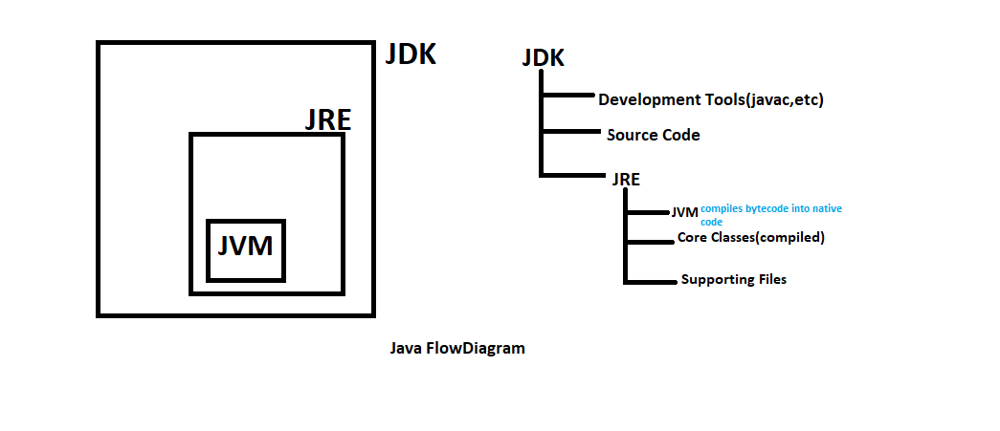

## java is object oriented programming language but not pure oops
## java is known for its "write once, run anywhere"



## public static void main(String[] args)
this is the main method, it is the entry point of a program 
static : indicates the method belongs to the class rather then an instance of the class , {no need to make any class}

String[] args : it accepts an array of strings as parameter, which pass in programs


## keys concepts in java
1. Class (a class is a blue for creating objects, it define structire and behaviour (methods) of objects)

1. Object (An object is an instance of a class. it represents a real-world entity and has attributes and behaviors) 
for eg : 
```java

    Car myCar = new Car();
    myCar.color = "red";
    myCar.drive();

```

## four pilers of oops

3. Encapsulations (it is combining of data and methods(functions) that operates into a sinngle unit(class). it also involves restricting direct access t o some components using modifiers eg., private and protected)

```java 

    class Employees{
        private String name;
        private int salary;

        public String getName(){
            return name;
        }

        public void setName(String name){
            this.name = name;
        }
    }
```
4. Inheritance (its allows a class to acquire properties and method of another class . it supports code reusability)
for eg : 
``` java
     
     class Animal {
        void eat(){
            System.out.println("this animal eats food")
        }
     }
     class Dog extends Animal {
        void bark(){
            Sytem.out.println("Dog Barks");
        }
     }
```
## note java does'nt support multiple inheritance

5. Polymorphism (it allows methods to perform different task based on he objects that call them, it can be 
## 1. Runtime polymorphism(Method Overriding, (like multiple)
## 2. Compile-time (Method Overloading)))
for eg:
compile-time (multiple methods with same name but different parameters)
``` java
    Class Calculator{
        //add two integers
        int add(int a, int b){
            return a + b;
        }
        //add three integers
        int add(int a, int b, int c){
            return a + b + c;
        }
    }
    public class Main{
        public static void main(String[] args){
            Calculator calc = new Calculator();
            System.out.println(calc.add(2, 4))
            System.out.println(calc.add(2, 4, 6));
            
        } 
    }
```

6. Abstraction (it focus only essential details while hiding the implementations), achived in two ways through
## abstract class and interface

## class--> Blueprint for objects
## interface --> Blueprint for class

## Interface
it can have abstract methods, static constants, static methods and default methods

## multithreading
it refers to the ability to execute multiple threads within a single process concurrently. inproving applications performance and responsiveness

the cpu often referred to as the brain of the computer , is responsible for executing instructions from the programs it perform basic arithematic logic control and input /output operations specified by the instructions
eg, modern cpu like intel core i7 or amd Ryzen7

a core is an individual processing unit within a cpu . modern cpus can have multiple cores allowing theim to perform multiple task simultaneously

program and process

thread: A thread is the smallest unit of executions within a process. a process can have multiple threads, which share same resource but can run independently
for eg web browser can open multiple tab for running different purpose


multitasking (managed by OS): allows an operating system to run multiple process simultaneously. improving productivity and system utilizations

** A thread is a lightweight process , the smallest ubit of processing . java support multithreading through its java.lang. thread class and the java.lang. Runable interface

``` java 
    System.out.println(Thread.currentThread().getName());
```

To create a new thread class in java, we can either extend the thread class or inplement the runnable interface

## collection framework
